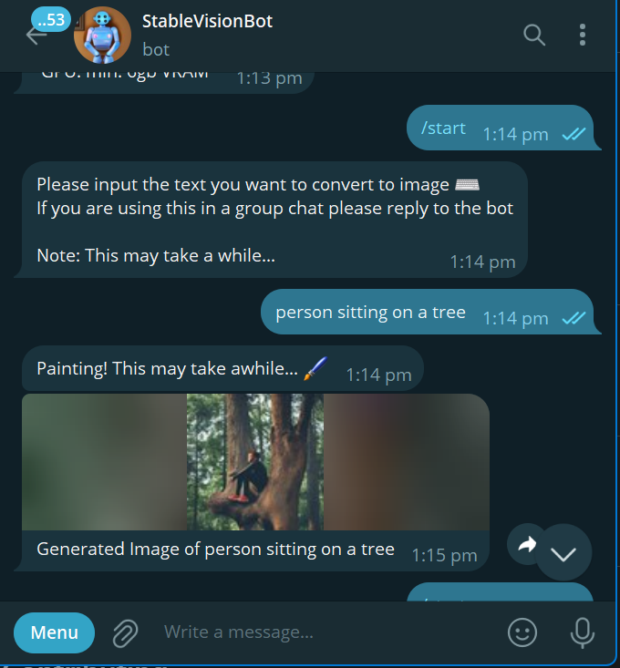
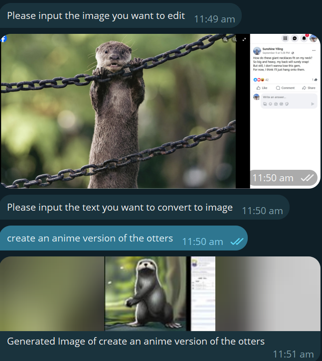

# StableVision :artist:


Simple telegram bot that generates images based on users text inputs by harvestingm00n :leaves:

Currently, the backend is hooked up with Stable Diffusion v2.0 :art: . It works comfortably on a RTX 3060 with 6gb VRAM.

It is built using the ptb package as well as the huggingface :hugs: diffusers library

I will be continuously improving and working on this model more so as a small project :

## Notice:
Currently, the board can only send photos that are up to 5mb big due to the limitations of ptb (as well as other post processing factors like limiting pixel to only 10000px). However, I am working on a feature where the bot will send a document which would bypass this issue. Any suggestions do send a pull request or let me know! :smile:


# Table of Contents :clipboard:
- [Features](#features)
- [Updates](#updates)
- [Installation](#installation)
- [Usage](#usage)
- [License](#license)


## Features
### Text To Image Generation :paintbrush:


### Image To Image Generation (Image Editing) :paintbrush:


## Updates
v1.0: Original release of model

## Installation 
Instructions on how to install and set up the project.

Step 1: Clone the repo using 

``` git clone https://github.com/harvestingmoon/StableVisionBot.git```

Step 2: Install the requirements needed for the bot to run

```pip install requirements.txt```

Step 3: Insert your ```model``` (Any Stable Diffusion Model from Huggingface) and telegram bot ```API_KEY``` on on ```config.yaml```
=> in the future I will open it up to other models

Step 4: Run the model either using ```cmd prompt``` using the following code (Before that, ensure that your command prompt is in the same directory as the file):

``` python bot.py```

or run it on VSCode by clicking the top right triangle


## Usage
```/start```: To Start The Bot

```/info```: Technical Information about the bot

## All Features
Model currently supports the following features:  
- Text to image AI generation
- Image to Image AI generation (Image editing)

Future features:
- Support other pipelines (currently support stable diffusion only)
- Image manipulation via text

## License
This project is licensed under the terms of the MIT License.
